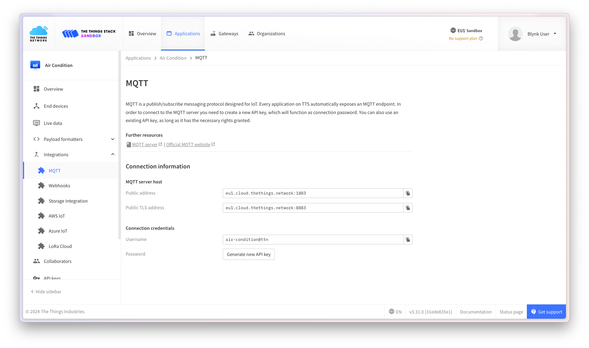

# Icon Segmented Switch

Presents two or more independently selectable options as icons and then updates the datastream with a numeric value corresponding to the index of the option selected by the user (index start is 0).



### Datastream

Select or create a datastream of [data type](https://docs.blynk.io/en/blynk.console/templates/datastreams/datastreams-common-settings/data-type) integer or enumerable. &#x20;

### Widget Controls

The widget has no controls other than buttons that allow the user to select the configured options.&#x20;

### How to process widget with the hardware

When button is pressed, value is sent and stored into the Blynk.Cloud. After that it's sent to your device.

#### Reading the widget value(s)

Example code:

```cpp
BLYNK_WRITE {
  switch (param.asInt()) {
    case 0: { // Item 1
      Serial.println("Item 1 selected");
      break;
    }
    case 1: { // Item 2
      Serial.println("Item 2 selected");
      break;
    }    
  }
}
```


#### Changing the widget state

You can set the state of the widget by updating the assigned datastream value using the hardware or HTTP API.

**Hardware:**

For a datastream V5 assigned data type of integer or enumerable, the following will change the option selection to the second (index = 1):

```cpp
Blynk.virtualWrite(V5, 1);
```

**HTTP API:**

```cpp
https://{server_address}/external/api/update/?token={your 32 char token}&V5=1
```


Sketch:[ Basic Sketch](https://github.com/blynkkk/blynk-library/blob/master/examples/GettingStarted/BlynkBlink/BlynkBlink.ino)

Sketch:[ ](https://github.com/blynkkk/blynk-library/blob/master/examples/More/Sync/ButtonInterrupt/ButtonInterrupt.ino)[Set Property](https://github.com/blynkkk/blynk-library/blob/master/examples/More/SetProperty/SetProperty\_SingleValue/SetProperty\_SingleValue.ino)

Sketch:[ ](https://github.com/blynkkk/blynk-library/blob/master/examples/More/Sync/ButtonPoll/ButtonPoll.ino)[VirtualPinWrite](https://github.com/blynkkk/blynk-library/blob/master/examples/GettingStarted/VirtualPinWrite/VirtualPinWrite.ino)

Sketch: [VirtualPinRead](https://github.com/blynkkk/blynk-library/blob/master/examples/GettingStarted/VirtualPinRead/VirtualPinRead.ino)\


### Change Widget Properties

You can change certain properties of the Widget from your hardware. For that, use this command:&#x20;

```cpp
Blynk.setProperty(vPin, "widgetProperty", "propertyValue"); 
```

Where:&#x20;

* `vPin` is: virtual pin number the widget is assigned to
* `widgetProperty`: property you want to change
* `propertyValue`: value of the property you want to change


Don't put **`Blynk.setProperty()`**into the **`void loop()`** as it can cause a flood of messages and your hardware will be disconnected. Send such updates only when necessary, or use timers.


### Properties you can change

You can change the properties _labels_, _label_, _color_, _isDisabled_, _isHidden_, and _page_ of the widget from your hardware, or via an [HTTP API](broken-reference). The URL must be encoded, so spaces in labels must be replaced with %20, and color hexadecimal values in the HTTP API URL must include the hash # character urlencoded as %23.

#### **Change Option Labels**

The _labels_ property for the two or more widget options can be changed from the hardware with this command:

```cpp
Blynk.setProperty(V1, "labels", "Unlocked", "Locked", "Reset");
```

The _labels_ property can also be changed from HTTP API:

```cpp
https://{server_address}/external/api/update/property?token={your 32 char token}&pin=V5&&labels=Unlocked&labels=Locked&labels=Reset
```

#### **Change Widget Label**

```cpp
Blynk.setProperty(V1, "label", "Select");
```

#### **Set Color**

```cpp
//#D3435C - Blynk RED 
Blynk.setProperty(V1, "color", "#D3435C");
```

#### **Disable/Enable**

Widget will be greyed out on UI and users won't be able to tap on it.

```cpp
Blynk.setProperty(V1, "isDisabled", true);
```

#### **Show/Hide**

Widget will be hidden from dashboard. Design your UI so that it doesn't look weird when there is no widget.

```cpp
Blynk.setProperty(V1, "isHidden", true);
```


### Change widget properties via HTTPs API



The endpoint allows you to update the Datastream Property value via GET request. All widgets (both web and mobile) that are assigned to this datastream will inherit this property. The Datastream Property is persistent and will be stored forever until you change it with another value. In order to clear the property you need to clear the device data in device actions menu.

**Example:**\
`https://blynk.cloud/external/api/update/property?token=GVki9IC70vb3IqvsV0YD3el4y0OpneL1&pin=V2&label=My%20Label`

`https://blynk.cloud/external/api/update/property?token=GVki9IC70vb3IqvsV0YD3el4y0OpneL1&pin=V1&color=%23D3435C`

`https://blynk.cloud/external/api/update/property?token=GVki9IC70vb3IqvsV0YD3el4y0OpneL1&pin=V1&isDisabled=true`



Device 

[auth token](../../concepts/device.md#authtoken)

 from Device info



The datastream 

[virtual pin](../../blynk.console/templates/datastreams/virtual-pin.md)

 (should start with "v")



The property of the widget you want to update: 

`onLabel`

, 

`offLabel`

, 

`label`

, 

`color`

, 

`isDisabled`

, 

`isHidden`

, and 

`page`



Get from the bottom right of your Blynk console. 

[More information](../../blynk.cloud/troubleshooting.md)

.



the text used as widget label



button color hexadecimal, must include the hash # character urlencoded as %23



true or false



true or false



```
```



```
{"error":{"message":"Invalid token."}}
```



### **Sync to the latest known state**&#x20;

You can update your hardware to the latest datastream value from Blynk.Cloud after your hardware went offline, and then came online again. Use `Blynk.syncVirtual()` to update a single virtual pin, or `Blynk.syncAll()` to update all virtual pins. See [State Syncing](../../blynk.edgent-firmware-api/state-syncing.md) for more details.

```cpp
BLYNK_CONNECTED() { 
  // Called when hardware is connected to Blynk.Cloud  

  // get the latest value for V1
  Blynk.syncVirtual(V1); 

  // Request Blynk server to re-send latest values for all pins
  Blynk.syncAll()
}
```
