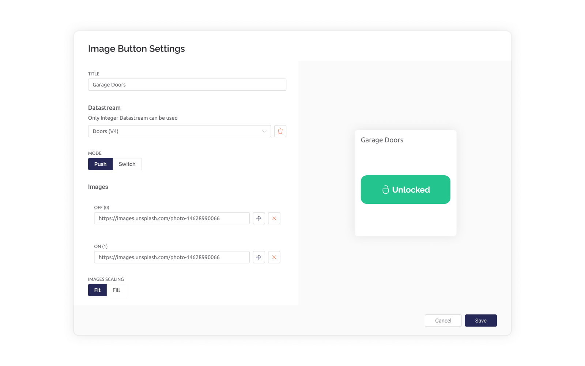

# Image Button

Available only for PRO users.


_**Note:**_ please remember that web and mobile app widgets are set up separately in the Web Dashboard and Mobile App Dashboard sections correspondingly. They can still use the same datastreams to access the same data (Map widget is an exception – a different codebase is used for Map on mobile and web).


The image button widget allows you to not only control your device by switching between two states (e.g. on/off) but also display any image making your dashboard more visually engaging.&#x20;

For the button image, you need to provide http/s URL. The URL should be a valid endpoint to the binary data of the image. URL shortener will not work.

The widget has two images representing on/off state.


The main use case for this widget is same as for on/off Switch widget but enriched with images.

### Settings



#### Datastream

Only Integer Datastream can be used here.

#### Mode

The image button widget can operate in these modes:

* **Push**: on click (mouse down) - the button will be turned on, on release (mouse up) - the button will return to its original state
* **Switch**: on click - the button will be turned on and the button will toggle between the on and off states with the next clicks

#### Images

**Off Image** - for the minimum datastream value\
**On Image** - for the maximum datastream value

#### Display options

As of now, the image button widget supports 2 display options:

* **Fit:** The image will be scaled to fit the height or width of the widget size
* **Fill:** The image will be scaled to fill the widget area. Cropping may occur

### How to send data from the device

By default, the widget uses 0/1 (LOW/HIGH) values. It sends 1 (HIGH) on press and sends 0 (LOW) on release in PUSH mode.\
You can also change the button state from the hardware side. For example, turn on the button assigned to virtual pin V1 by sending value 1, for example:

```
Blynk.virtualWrite(V1, 0); // show off image
Blynk.virtualWrite(V1, 1); // show on image
```

Don't put `Blynk.virtualWrite()` into the `void loop()` as it can cause a flood of messages and your hardware will be disconnected from the server for spam. Send such updates only when necessary.

### Get data using Blynk library

You can also get the button state from the server in case your hardware was disconnected with the Blynk Sync feature :

```
BLYNK_CONNECTED() {
  Blynk.syncVirtual(V1);
}

BLYNK_WRITE(V1) {
  int buttonState = param.asInt();
}
```

### Set image URLs via setProperty function

You can set **onImageUrl** via setProperty function:

```
Blynk.setProperty(V1, "onImageUrl", "https://host/static/icon.png");
```

You can set **offImageUrl** via setProperty function:

```
Blynk.setProperty(V1, "offImageUrl", "https://host/static/icon.png");
```

### Send data using HTTP API

Please check this article [https://docs.blynk.io/en/blynk.cloud/update-datastream-value](https://docs.blynk.io/en/blynk.cloud/update-datastream-value)
