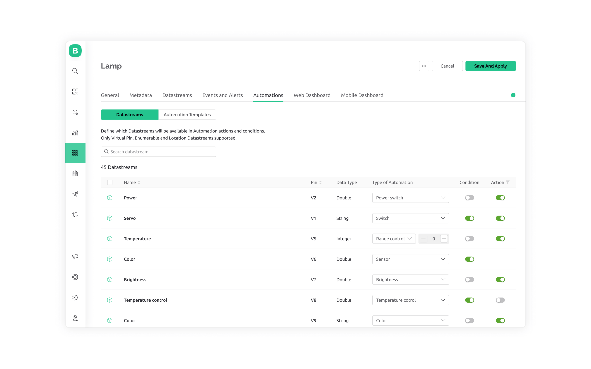
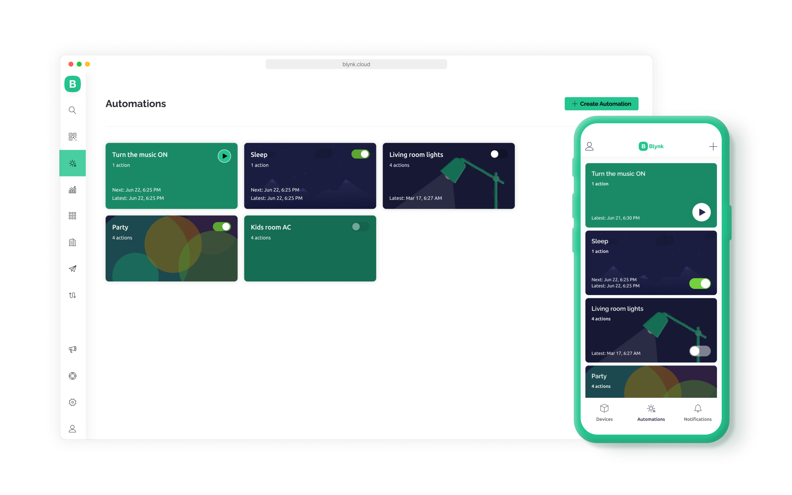
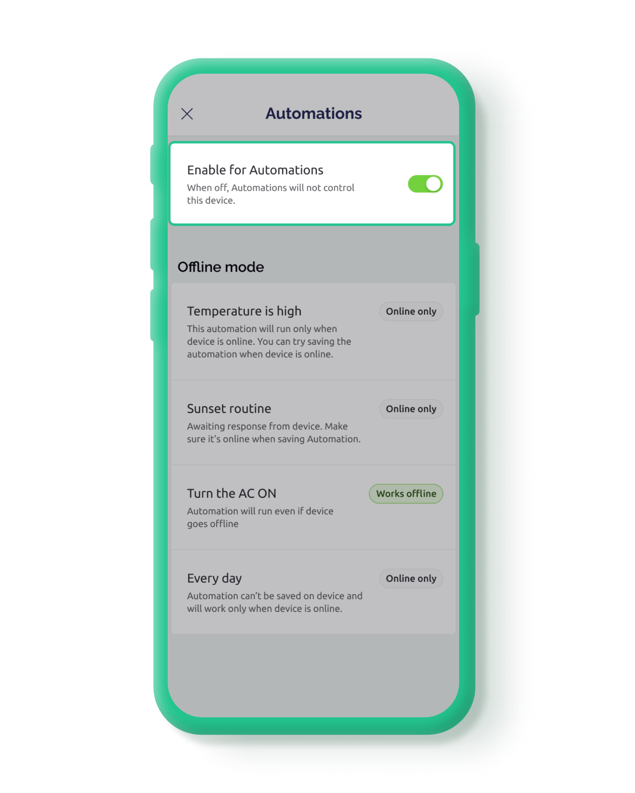

# Automations

### Introduction

Automations allow the end-user of your app to create scenarios where the device automatically performs one or more **actions** based on a **condition**.

A manufacturer (or developer) defines which parameters of the device can be automated by end customers.&#x20;

### Types of conditions

The types of **conditions** are:&#x20;

* **Schedule:** triggers an event based on the current date/time reaching a particular set of date/time values (all relative to a specified time zone)
* **Sunrise/Sunset:** triggers an event when the time before/after sunrise/sunset occurs relative to a set of defined weekdays, at a specific geographic location.
* **Device State:** triggers an action based on the value of a [Datastream](../blynk.console/templates/datastreams/).&#x20;
* **Scene:** manually triggers an automation scenario from the [Blynk.App](broken-reference) mobile app or the [Blynk.Console](broken-reference) web app.

### &#x20;Actions

One or more actions may be executed sequentially or simultaneously when a condition's requirement has been met. The types of actions include:

* Sending a mobile app notification
* Forwarding device data to some other device datastream
* Sending an email
* Setting a delay
* Setting a [Datastream](../blynk.console/templates/datastreams/) value.&#x20;

### Interoperability

Automations are designed to work across all properly configured devices. This means that one condition can be used to perform actions on multiple devices.

Note that the value of a Datastream may be used by a condition, and action can be configured to set a Datastream to a new value. Using widgets on the Blynk.Console and/or Blynk.App, you can visualize and change the values of Datastreams. You may also access Datastreams within the firmware of an IoT device, and by using the Blynk.Cloud HTTPS API.

## How to Set Up Automations in Blynk

### 1. Prepare the Template and Datastreams

#### Check permissions

[Automations](automations.md) are created per [Organization](organizations.md) and are only available for users with permission for it. By default, the first user in the Organization becomes a [Developer](users/#developers) and has sufficient permissions to create an Automation.

Enable automation permissions for other roles by visiting [Blynk.Console](broken-reference), click on the 'Settings' option on the main menu, access the 'Roles and permissions' menu option, expand the 'Organizations' section and find the 'Automations' permissions. Set the role's create/edit/view/delete/execute/manage permissions as appropriate for the role.

#### Check Developer Mode

The [Developer Mode](developer-mode.md) must be turned on in order to edit the Automations options for a [Template](device-template.md).  The Developer Mode can be turned on from [Blynk.Console](broken-reference) or the [Blynk.App](broken-reference).


The ‘Automations’ icon in both the Blynk.App and the Blynk.Console will not be visible until at least one [Datastream](broken-reference) listed in the Template under the ‘Automations’ tab has a condition or action option turned on.


Even if none of your existing Datastreams will be involved in any Automation, you can simply enable the Condition or Action switch for any Datastream (no harm will be done), or create a Datastream if none exist. Otherwise, build your first Automation based on the Datastream that will be used as either the ‘Condition’ or ‘Action’ for the Automation.

#### Set up Automations in Template

Go to Blynk.Console ->Templates -> Template you are working with -> **Automations** tab.&#x20;

A list of Datastreams for the Template will appear, with columns labeled 'Condition' and 'Action' that each has an enable/disable switch for each Datastream. At the top right of the screen, click the 'Edit' button.

In the table column labeled **Type of Automation**, make a choice for the Datastream to be associated with your Automation.  The choices vary by the [Datastream](../getting-started/template-quick-setup/set-up-datastreams.md) data type (double, integer, string, enumerable).  All options except for ‘Sensor’ define what type of GUI control will be presented to the User when defining the Automation in the Blynk.App.

#### Template Automation Options

| **Automation Type** | 
<strong>Data</strong>  <strong>Type</strong>
     | **Description**                                                                                                | **Blynk.App Automation GUI Control** |
| ------------------- | ---------------------------------------------------------- | -------------------------------------------------------------------------------------------------------------- | ------------------------------------ |
| Power Switch        | Integer                                                    | Typically 0 = on, 1 = off Max 1 Power Switch per product                                                       | Switch                               |
| Switch              | Integer                                                    | Typically 0 = on, 1 = off                                                                                      | Switch                               |
| Range Control       | Integer                                                    | The min/max is defined by the Datastream. The slider step value is defined in the ‘Type of Automation’ column. | Slider                               |
| Color               | String                                                     | Color value and Alpha (transparency)                                                                           | Color Slider                         |
| Enumerable          | Enumerable                                                 | An integer value corresponds to a string value                                                                 | a list of the enumeration values     |
| Sensor              | 
Double 

Integer

String

Enumerable
 | Cannot be an action                                                                                            | N/A                                  |

If the value of the Datastream will be used to trigger an action, then enable the ‘Condition’ switch in the table.  If the value of the Datastream is to be changed by the Automation, then enable the ‘Action’ switch in the table.

1. Enable at least one Condition or Action for a Datastream and then click the **Save And Apply** button at the top right of the screen.&#x20;
2. Refresh the browser window (CTRL-F5), and the Automations icon should be now visible in the [Blynk.Console](broken-reference) side menu.&#x20;
3. Restart the [Blynk.App](broken-reference), and the Automations icon will be visible at the bottom of the screen in between the Devices and Notifications icons.

You may create an Automation scenario in either the [Blynk.Console](broken-reference), or the [Blynk.App](broken-reference). Creating an Automation in one app will cause it to be accessible in the other app (you may need to refresh the other app).

###

### 2. Create an Automation

From the [Blynk.Console](broken-reference), click on the Automations icon on the main menu.  From the [Blynk.App](broken-reference), click on the ‘Automations’ icon at the bottom of the home screen.

### Conditions

Choose a condition from one of the options below:

* **Schedule** allows you to trigger an action based on the current date/time reaching a particular set of date/time values (all relative to a specified time zone).
* **Sunrise/Sunset** triggers an action when the time before/after sunrise/sunset occurs according to a set of weekdays, at a specific geographic location.
* **Device State** triggers an action based on the value of a Datastream. See [Configuring a Device State Condition](automations.md#configuring-a-device-state-condition) for more details.
* **Scene** is a manual trigger of an Automation directly from the 'Automations' page in the Blynk.Console or Blynk.App.

### Actions

After you have the _When_ condition defined, the next step is to configure one or more 'Do this' actions. The action choices are:

* **Control Device** - select a specific Device to control by setting a Datastream value.
* ****[**Forward Device Data**](automations/forward-device-data.md) - update a datastream value for any device with the datastream value from the device assigned to this automation. This option works with datastreams of data type integer, double, and string and is currently available only in Blynk.Console. ****&#x20;
* **Send Email** will send an email to one or more Users with optional details about the Organization, Template name, Device name, and/or Datastream value included (availability of each depends on the Datastream data type and type of automation).
* **Send In-App Notifications** to one or more Users' Blynk.App with optional details about the Organization, Template name, Device name, and/or Datastream value included (availability of each depends on the Datastream data type and type of automation).
* **Wait, Then Do Something** - delay until a specific time of the day is reached (in a specified timezone), or until a timer between 1 sec and 24 hours elapses.
* **Send SMS** will send a text message to one or more Users's Blynk.App with optional details about the Organization, Template name, Device name, and/or Datastream value included (availability of each depends on the Datastream data type and type of automation). This option is available only to BUSINESS subscribers.

### Placeholders

The ‘Send Email’, ‘Send In-App Notifications’, and ‘Send SMS’ actions support the use of placeholders. Placeholders are key/value pairs that refer to Blynk account metadata and [Datastream](../getting-started/template-quick-setup/set-up-datastreams.md) values.

* **{ORG\_NAME}** - name of the organization the device is assigned to.&#x20;
* **{PRODUCT\_NAME}** - name of the Template used.&#x20;
* **{DEVICE\_NAME}** - the IoT Device name as displayed under ‘DEVICES’.
* **{TRIGGER\_VALUE}** - if a Device State trigger was used, this will be the value of the trigger.

The 'Name' and 'Cover' should also be configured for the new [automation](automations.md).&#x20;

### Automation Settings (Limit Period, Name, Cover)

The 'Name' and 'Cover' should also be configured for the new automation in the 'Settings' section.&#x20;

If the Automation has a Device State condition defined, then an option of 'LIMIT PERIOD' is available and should be configured. The limit period prevents multiple executions of an Automation within the limit period duration, beginning from when the last trigger occurred.


**Limit Period Example**

For the Automation scenario of: “When the temperature is higher than 40, send Email Notification" with a **limit period** of 1 hour”, if the temperature rises and exceeds 40 at 9:30 am, then no additional notifications will be sent until 1 hour later at 10:30 am. At 10:30 am, the limit period resets, permitting another notification to be sent at 11:30 am if the temperature continues to exceed 40.


### Configuring a Device State Condition

The condition (When) option of ‘Device State’ triggers an action based on the value of a datastream.

After selecting the ‘Device State’ option, you need to specify the device, then the datastream, and finally what type of datastream value change to monitor from the dropdown lists.

<figure><figcaption></figcaption></figure>


The options ‘Is On’ and ‘Is Off’ require that the datastream is set back to the default state after the automation is triggered in order for the automation to execute again. To avoid having to reset the device state use the 'Is Any' or 'Has Changed' option as in the example below.


The ‘Is Any’ option detects an update to the value for the datastream (it can be the same as prior, or changed). The ‘Has changed’ option checks that the new datastream value has changed from the prior value.

#### ‘Is Any’ Device State Condition Example

A integer type datastream V20 is configured as shown below.

<figure><figcaption></figcaption></figure>

An automation is created as shown below with the ‘LIMIT PERIOD’ set to ‘No Limit’.

<figure><figcaption></figcaption></figure>

The automation Device State condition is set to ‘Is Any’ for datastream V20 ('Has Changed' could be used as well, with the exact same behavior). A two second timer is executed, and then the V20 datastream is set to off (value of zero).

<figure><figcaption></figcaption></figure>

Configuring a switch in the Blynk.Console web dashboard for datastream V20 will allow you to set V20 to on (value of 1), and after two seconds you will see the value changed back to a value of off (zero) by the automation. Click the switch on again and the automation will turn off the switch after two seconds.


If the Device State condition is set to ‘Is On’, then the automation will only execute once, unless the value of the datastream is changed manually with the dashboard switch, or by the hardware. See the next example [‘Is On’ Device State Condition Example](automations.md#is-on-device-state-condition-example).


#### ‘Is On’ Device State Condition Example

Configure a datastream, automation, and web dashboard as specified in the prior example [‘Is Any’ Device State Condition Example](automations.md#is-any-device-state-condition-example). Modify the device state condition, changing it from ‘Is Any’ to ‘Is On’.

<figure><figcaption></figcaption></figure>

When you click the web dashboard switch for V20 ‘on’, you will observe the switch turn off after two seconds by the automation. However, if you try it again, the switch will not be turned off (datastream set to a value of zero) by the automation. The automation will not execute again until the datastream is set back to the default state (a value of zero) by either manually clicking the web dashboard switch on/off, or by the IoT hardware.

The described behavior is similar if a datastream with a default value of 1 is used with the ‘Is Off’ automation device state condition, but now the values 0 and 1 (off /on) are reversed.

Consider carefully this automation behavior for ‘Is On’ and ‘Is Off’ when creating an automation.

### 3. Automation Management

After the [Automation](automations.md) is configured, it will appear in the 'Automations' list as a card, with the count of actions defined, and the last date/time that the Automation was executed. A switch on the card allows the Automation to be enabled/disabled.

If the condition of type 'Scene' was chosen, a 'Execute automation' button will also be available within the rectangle, otherwise, a 'Disable automation' button will be available.

The images that follow, show how the Automation card appears in both the Blynk.Console and the Blynk.App. Recall that creating an Automation in one app (Blynk.Console or Blynk.App) will cause it to be accessible in the other app.

Within the Blynk.App, you can see Automations the device is participating in. From the Device page, select the ‘...’ icon in the upper right of the screen. Choose the ‘Information’ tab, and the Automations the device is participating in will be listed under the ‘AUTOMATIONS’ section.

If you click on the ‘AUTOMATIONS’ section, you may enable/disable the participation of the Device in Automations.

### Automations Logs

In the [Blynk.Console](broken-reference), you may also view the Automation Logs while editing an Automation.  This option is not available in the [Blynk.App](broken-reference).

Selecting the ‘Automation Logs’ icon will display a page with a history of the executions of the [Automation](automations.md).  The summary includes the date/time when it was executed, from what [Device](device.md), the Datastream employed, and the value of the [Datastream](../getting-started/template-quick-setup/set-up-datastreams.md).

