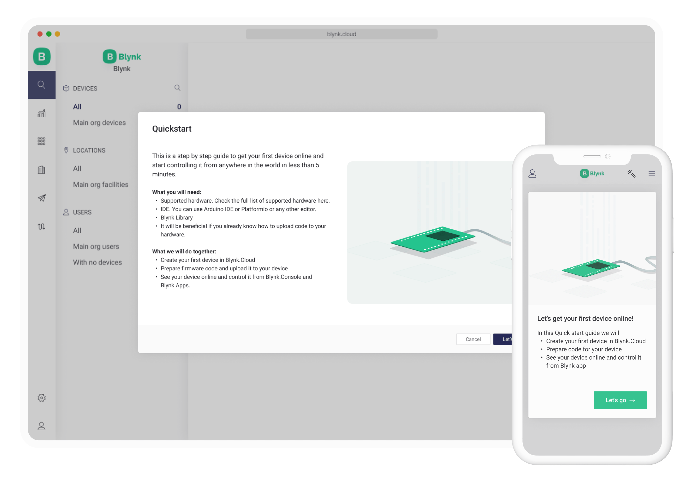

# Quickstart

We've prepared a quick and easy way to connect your first device. Whether you are using Blynk.Console or Blynk.Apps, on your first login, it will start automatically. We highly recommend to follow these guides to get the first results and move forward.&#x20;

### To get started:

1. Create a Blynk account using [Blynk.Console](https://docs.blynk.io/en/blynk.console/console-overview) or [Blynk.App for iOS or Android](../../downloads/blynk-apps-for-ios-and-android.md).
2. Switch to [Developer Mode](../../concepts/developer-mode.md) in Blynk.Console or Blynk.App
3. Have a supported hardware (ESP32, Arduino, Raspberry Pi, etc). The list of supported devices is [here](../../blynk.edgent-firmware-api/supported-boards.md).
4. Be familiar with the basics of electric circuitry and know how to at least blink an LED using Arduino boards, know how to install new Arduino libraries, etc.


If you skipped **Quickstart** on the first app launch, you can always find it in the Blynk.Console side menu, under Help section or in Blynk App:&#x20;

.png>)   


When your device gets online,  learn how it was setup:


[how-quickstart-device-was-made.md](how-quickstart-device-was-made.md)


