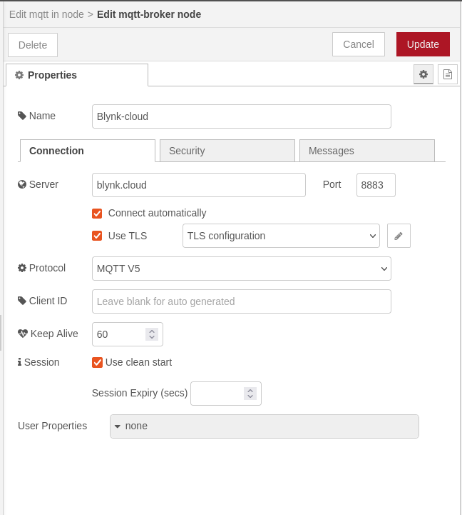
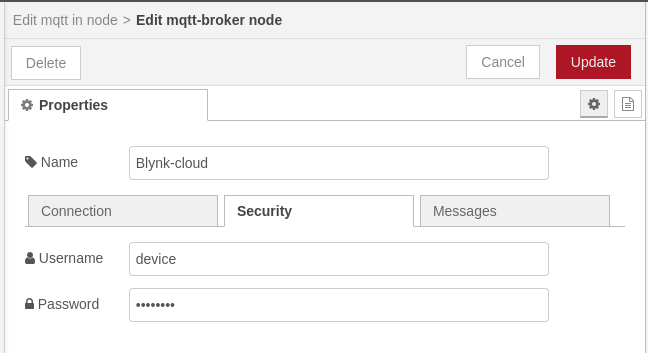
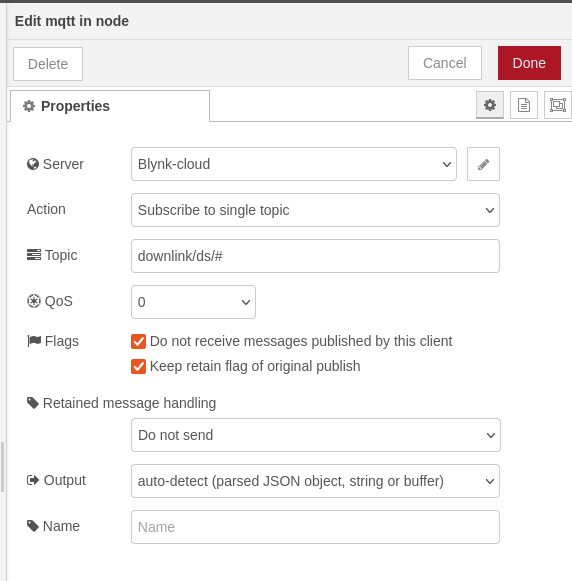
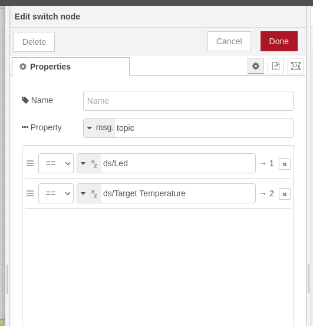
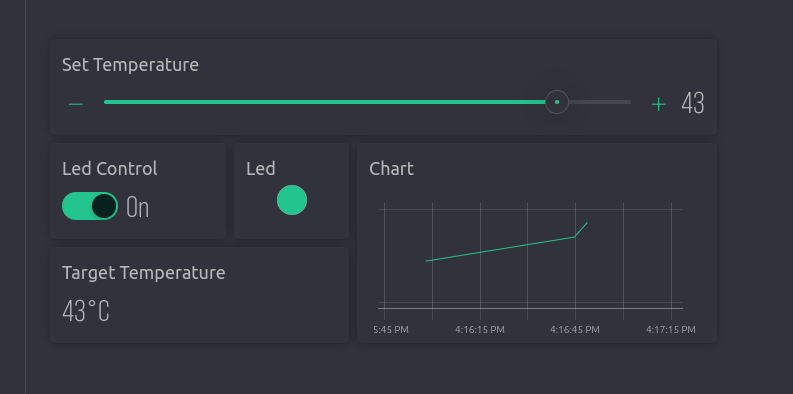

# Node-RED client via Secure MQTT connection

Node-RED simplifies the integration of devices, APIs, and online services through its visual programming interface. With drag-and-drop functionality, users can effortlessly create workflows by connecting nodes to perform various tasks without extensive coding. It finds widespread use in IoT, home automation, and industrial applications due to its flexibility, scalability, and user-friendly nature. From basic data collection to intricate automation scenarios, Node-RED facilitates swift development of IoT solutions.

---

## Prepare Blynk.Cloud

1. **Go to Blynk.Cloud:** Visit [blynk.cloud](https://blynk.cloud) and navigate to the Developer Zone.

2. **Create Template:** Create your own template with the following specifications:
   - **Name:** template name
   - **HW:** other
   - **Connection type:** wifi

3. **Edit Datastreams:** Customize the datastreams for this template according to the table below:

   | Virtual Pin | Name               | Data Type | Desc                                          |
   |-------------|--------------------|-----------|-----------------------------------------------|
   | V0          | Led                | Integer   | Indicates whether the LED is on (1) or off (0)|
   | V1          | Led Control        | Integer   | Control for LED (ON/OFF)                      |
   | V2          | Set Temperature    | Double    | Temperature value to be set                   |
   | V3          | Target Temperature | String    | Target temperature information                |

4. **Edit Web Dashboard:** Enhance the web dashboard for this template by adding LED, label, slider, and switch widgets. Connect each widget to its corresponding datastream. Save the configuration.

   | Widget | Datastream         |
   |--------|--------------------|
   | Led    | Led                |
   | Label  | Target Temperature |
   | Slider | Set Temperature    |
   | Switch | Led Control        |

5. **Create Device:** Now, create a device associated with this template.


Be sure to take note of the device credentials displayed in the upper right corner. You'll need them for the next step.


## Install Node-RED

Follow the instructions outlined in the [official Node-RED documentation](https://nodered.org/docs/getting-started/local) to install Node-RED on your system.

## Configure the MQTT Broker

1. Obtain the properties of the "mqtt in" node and select the option "Add new mqtt-broker" for the field "Server." Proceed to edit the configuration with the following details:

   - **Connection tab:**
     - Server: `blynk.cloud` (it is better to specify your [regional server](../blynk.cloud/device-mqtt-api/authentication.md))
     - Port: `8883`
     - Protocol: `MQTT V5`
     - Keep alive: `45`
     - Use TLS: TLS configuration
       - CA Certificate: upload `ISRG_Root_X1.der`
       - Server name: same as Server field

   

   - **Security tab:**
     - Username: `device`
     - Password: your device Auth Token

   

   Once all the required fields are filled, click the Update button, and select your configured broker from the list of servers.

2. **Setting Up the Node-RED Flow**

   After configuring the MQTT broker, follow these steps to set up the Node-RED flow:

   1. Create a flow within Node-RED.
   2. From the "Network" section, add the "mqtt in" and "mqtt out" nodes to your flow.
   3. [Configure the MQTT Broker](#configure-the-mqtt-broker).
   4. Adjust the properties of the "mqtt in" node as follows:
      - Server: choose your configured server
      - Action: Subscribe to single topic
      - Topic: specify the desired topic from which you want to retrieve data. For instance, setting it to **downlink/ds/#** will fetch data from the slider datastream.
      - QoS: 0

   

   5. Customize the properties of the "mqtt out" node:
      - Select the previously configured server.
      - Set the topic where you wish to send data, e.g., any datastream from blynk.cloud.
      - Adjust the QoS to 0.

## Create a Node-RED flow

1. [Configure the MQTT Broker](#configure-the-mqtt-broker) with subscribe to **downlink/ds/#**.
2. Add two mqtt out nodes for **ds/Led** and **ds/Target Temperature** datastreams.
3. Add a node named "function" and add the provided code to it.

   ```js
    var returnMsg = null;

    if (msg.topic == "downlink/ds/Led Control") {
       returnMsg = { topic: "ds/Led", payload: msg.payload };
    } else if (msg.topic == "downlink/ds/Set Temperature") {
        returnMsg = { topic: "ds/Target Temperature", payload: msg.payload + "°C"};
    }
    // Return the messages
    return returnMsg;

   ```
4. Add a node named "switch" to check the property "msg.topic" for **ds/Led** and **ds/Target Temperature**.



5. Connect two outputs of the switch node to mqtt out nodes created in step 4. The first one to **ds/Led** and the second one to **ds/Target Temperature**.

As a result, you should get this flow:


## Run the Sample Using Node-RED

Deploy your flow (using button as the same name **Deploy**) and go to blynk.cloud for testing. When you toggle the switch, the LED will turn on or off. Setting the temperature will update the label widget with the value of the target temperature.



